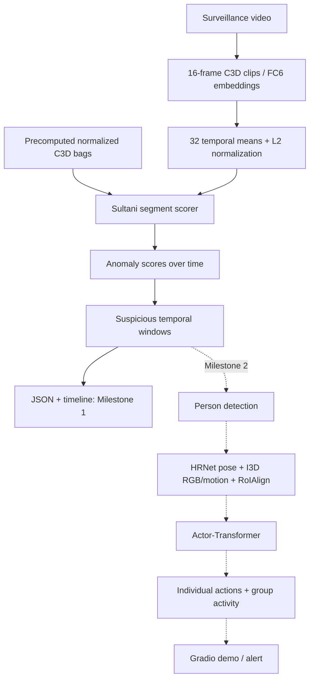

# Surveillance behavior anomaly research

A modular HCI research project for a future classroom/professor demonstration of
violence and suspicious group activity in surveillance video. **Milestone 1 implements
Sultani-style binary anomaly localization.** Actor-Transformer and a Gradio demo are
Milestone 2. The current model does not distinguish fighting, assault, robbery, or
other anomaly types.

"Goons" is informal project framing. The system detects **observable behavior**;
it does not infer that a person intrinsically "is a goon," assign character labels,
or infer criminal intent.

## Papers and current status

- Sultani, Chen, and Shah (CVPR 2018), [Real-world Anomaly Detection in Surveillance Videos](https://openaccess.thecvf.com/content_cvpr_2018/html/Sultani_Real-World_Anomaly_Detection_CVPR_2018_paper.html).
  Implemented: C3D feature bags, scoring network, MIL objective, training,
  evaluation, temporal inference, and timelines. [Author implementation](https://github.com/WaqasSultani/AnomalyDetectionCVPR2018)
  supplies the reference network details and coefficients.
- Gavrilyuk, Sanford, Javan, and Snoek (CVPR 2020), *Actor-Transformers for Group
  Activity Recognition*. Planned; no placeholder model or substitute backbone.

**No benchmark results have been measured or reproduced.** Synthetic tests establish
software behavior, not surveillance detection accuracy.



## Installation

Python **3.11+**. Run from the repository root. CPU is supported; install a
compatible CUDA PyTorch build separately if required. Installation downloads Python
dependencies, never datasets or pretrained weights. torchvision is unnecessary for
this C3D implementation; it can be added for the future person/RoIAlign stage.

```powershell
python -m venv .venv
.venv\Scripts\Activate.ps1
python -m pip install -e ".[dev]"
```

Alternatively, with uv:

```powershell
uv --cache-dir .uv-cache venv .venv --python python
uv --no-cache pip install --python .venv/Scripts/python.exe -e ".[dev]"
```

Without activation, use `.venv/Scripts/python.exe` instead of `python`. For
deterministic CUDA GEMM set `$env:CUBLAS_WORKSPACE_CONFIG = ":4096:8"` before
starting Python. Reproducibility assumes a fixed software and device environment.

## Datasets and manifests

Install [DCSASS](https://www.kaggle.com/datasets/mateohervas/dcsass-dataset) and
UCF-Crime locally following [data/README.md](data/README.md), including its label,
source-map, split-list, and temporal-annotation formats. **DCSASS derives from
UCF-Crime material; these are not independent cross-dataset evidence.** Use common
original source IDs and source-aware splits. Official UCF held-out sources must also
be held out from DCSASS training when using the official UCF test set.

```powershell
python scripts/prepare_dcsass.py --root data/raw/dcsass --labels data/raw/dcsass/labels.csv --output data/manifests/dcsass.jsonl --seed 7
python scripts/prepare_ucf_crime.py --root data/raw/ucf_crime --output data/manifests/ucf_crime.jsonl --train-list data/splits/ucf_train.txt --test-list data/splits/ucf_test.txt --annotations data/splits/ucf_temporal.txt
```

Omit official list/annotation flags if unavailable to create a seeded **research
split**, not an official benchmark split. Unknown original identities require a
`--source-map`. Inspect printed split/class counts before training: group splitting
is not stratified and tiny splits may lack a class. DCSASS requires actual clip
labels in a normalized CSV; folder names are not sufficient for binary labels.

## C3D features

Precomputed bags are finite `[32,4096]` `.npy` arrays or tensor `.pt`/`.pth` files;
author-style whitespace `.txt` bags are supported. Bags must already be temporal
means and L2-normalized. Add `feature_path` to manifest records. Paths resolve
relative to the manifest directory. Training does not silently alter imported bags.

For raw video supply compatible **local pretrained C3D FC6 weights**. The adapter
strictly checks parameter keys/shapes, with no random-weight extraction fallback
or torchvision substitution. The CLI requires checkpoint-specific means/order:

```powershell
python scripts/extract_c3d.py --manifest data/manifests/ucf_crime.jsonl --output-manifest data/manifests/ucf_features.jsonl --feature-dir data/features/c3d --c3d-checkpoint checkpoints/c3d_fc6.pt --mean 0 0 0 --channel-order bgr --device auto
```

**Zero means here illustrate syntax; they are not verified pretrained settings.**
Replace mean/order with your checkpoint's preprocessing. Spatial mean volumes,
alternative crops, or scaling require adapting and validating `video/transforms.py`.
Extraction uses nonoverlapping 16-frame clips at native FPS, final-frame padding,
post-ReLU FC6, segment averaging, and L2 normalization.

For N >= 32 units, boundaries `floor(i*N/32)` cover every unit once. For N < 32,
32 disjoint nonempty partitions are impossible: the documented policy repeats
`floor(i*N/32)` units in order. Empty inputs fail.

## Training

```powershell
python scripts/train_sultani.py --config configs/sultani_mil.yaml --manifest data/manifests/ucf_features.jsonl --output runs/sultani
tensorboard --logdir runs/sultani/tensorboard
# For an interrupted run, resume below. After a completed run, first increase
# training.epochs in configs/sultani_mil.yaml (for example, 20 to 30).
python scripts/train_sultani.py --config configs/sultani_mil.yaml --manifest data/manifests/ucf_features.jsonl --output runs/sultani --resume runs/sultani/last.pt
```

Network: `4096 -> 512 (ReLU) -> 32 (linear) -> 1 (sigmoid)`, dropout 0.6 after
both hidden layers and Xavier normal initialization, matching the released author
network. Shapes: `[B,S,D] -> [B,S]`; dimensions/dropout are configurable.
`batch_size: 30` means 30 abnormal/normal **pairs**, or 60 videos. Each epoch visits
the larger class and cycles through the independently shuffled smaller class.

```text
ranking    = mean_b relu(margin - max_s a[b,s] + max_s n[b,s])
sparsity   = mean_b sum_s a[b,s]
smoothness = mean_b sum_s (a[b,s+1] - a[b,s])^2
MIL total  = ranking + lambda_sparse*sparsity + lambda_smooth*smoothness
train loss = MIL total + weight_l2 * sum(weight parameters squared)
```

The loss API exposes unweighted components and weighted total. `8e-5` sparsity and
smoothness coefficients and `0.001` squared-weight penalty follow released author
code. Our reductions average over pairs/bags; its released implementation compares
all normal/abnormal pairs and scales regularization differently. This is a readable
paper-style baseline, not an exact Keras/Theano training port.

Adagrad LR **0.001** follows the requested default (released author script: 0.01).
Our **20 epochs**, pair sampling, and validation selection are implementation
defaults, not claimed paper settings. Adagrad, Adam, and SGD are configurable.
`last.pt` saves model, optimizer, config, epoch, best value, and selection metric.
`best.pt` selects validation **bag ROC-AUC** when both classes exist; otherwise
minimum training loss, with a warning. Test data never selects checkpoints.
Resume in the same run directory. Settings must match except the total epoch target,
which can increase. Per-epoch seeds support deterministic resumption.
Use the same manifest/features when resuming; checkpoints do not fingerprint the data.

## Evaluation

```powershell
python scripts/evaluate_sultani.py --checkpoint runs/sultani/best.pt --manifest data/manifests/ucf_features.jsonl --mode bag --output outputs/bag_metrics.json
python scripts/evaluate_sultani.py --checkpoint runs/sultani/best.pt --manifest data/manifests/ucf_features.jsonl --mode frame --projection repeat --output outputs/frame_metrics.json
```

JSON includes ROC points/AUC, precision, recall, F1, false-positive rate, and
`[[TN,FP],[FN,TP]]` confusion matrix. Single-class ROC-AUC is undefined (`null`).
The default threshold is 0.5; tune thresholds on validation data.
Bag mode uses maximum segment score and weak video labels. This reduced evaluation
**is not UCF frame-level ROC-AUC**. Frame mode requires temporal ground truth for
abnormal videos; it refuses missing annotations. Normal labels imply normal frames.
Projection uses uniform floor partitions or segment/frame-center interpolation.
Uniform duration alignment approximates unequal clip partitions and final padding; validate
exact feature/frame alignment before claiming benchmark reproduction.

## Inference and visualization

```powershell
python scripts/infer_video.py --checkpoint runs/sultani/best.pt --features data/features/c3d/ucf_crime/Fighting/Fighting001_x264.npy --duration-sec 120 --output outputs/anomaly.json
python scripts/infer_video.py --checkpoint runs/sultani/best.pt --video data/raw/ucf_crime/Fighting/Fighting001_x264.mp4 --c3d-checkpoint checkpoints/c3d_fc6.pt --mean 0 0 0 --channel-order bgr --threshold 0.5
```

Replace raw-video mean/order as described above. Missing C3D weights produce useful
errors. Feature inference only needs the trained scorer. Result: maximum overall
score, 32 scores, segment start/end seconds, merged suspicious intervals, and
metadata. Scores are not calibrated probabilities. The timeline defaults to
`outputs/anomaly_timeline.png`; `configs/demo.yaml` supplies the default threshold.

```python
from pathlib import Path
from surveillance.inference.anomaly_pipeline import AnomalyPipeline
from surveillance.training.sultani_trainer import load_checkpoint

model, saved = load_checkpoint(Path("runs/sultani/best.pt"))
pipeline = AnomalyPipeline(model, num_segments=saved["config"]["num_segments"])
# features: precomputed [32,4096] NumPy array or torch tensor
result = pipeline.predict_features(features, duration_sec=120, threshold=0.5)
```

## Testing and structure

Tests generate synthetic features and tiny videos. C3D shape tests use meta tensors;
no dataset or pretrained checkpoint download is required.

```powershell
python -m pytest -q --basetemp .pytest_cache/local-temp
ruff check .
ruff format --check .
```

```text
configs/                   Experiment and inference YAML
data/                      README, manifests/, splits/
src/surveillance/
  config.py                YAML loading
  datasets/                JSONL, source splits, DCSASS/UCF, feature loading
  video/                   Decode, segmentation, C3D transforms
  features/                C3D FC6 and extractor protocol
  models/sultani/           Scorer and MIL objective
  training/                Pair sampling, seeds, checkpoints, TensorBoard
  evaluation/              Binary metrics, temporal projection, manifest evaluation
  inference/               AnomalyPipeline and result schema
  visualization/           File-based timeline
scripts/                   Preparation, joint split, extraction, train/eval/infer
tests/                     Numerical, leakage, video and pipeline coverage
docs/                      Implementation record
```

## Limitations and future work

External data and compatible pretrained C3D weights remain required for real
experiments. Record their licenses and preprocessing/source provenance. Container
frame metadata can be approximate; frame evaluation assumes constant FPS. The
decoder does not resample FPS. Source splitting cannot detect wrong source IDs.
The binary scorer can mistake unusual benign behavior for anomalies. No operational
accuracy or benchmark result is established.

Milestone 2: implement person detection/tracks, HRNet-W32 pose/static features,
I3D dynamic RGB features, RoIAlign, and Actor-Transformer with individual-action
and group-activity heads. Feed suspicious temporal windows into that stage, test
actor/modality alignment and behavior labels, then build the Gradio demo. Labels
such as fighting/aggressive interaction require actual annotations; anomaly scores
cannot supply these classes. Add real implementations under `models/actor_transformer/`
and `features/` when ready.
