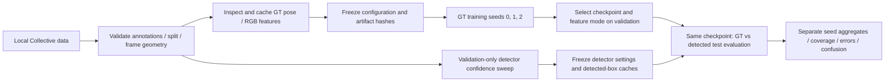
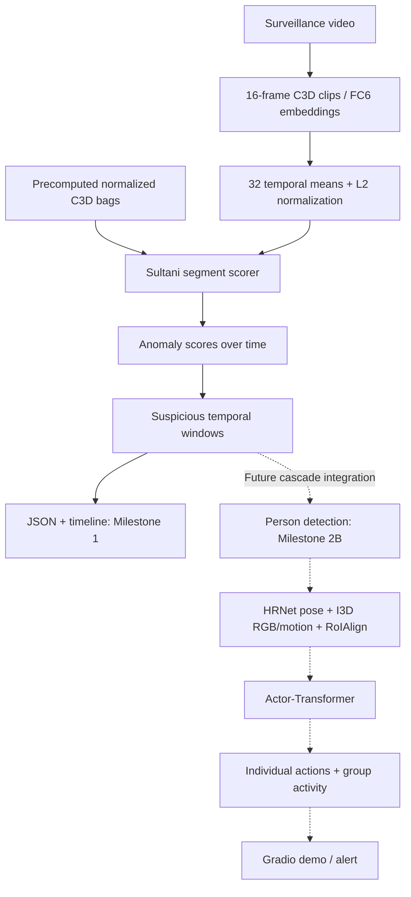
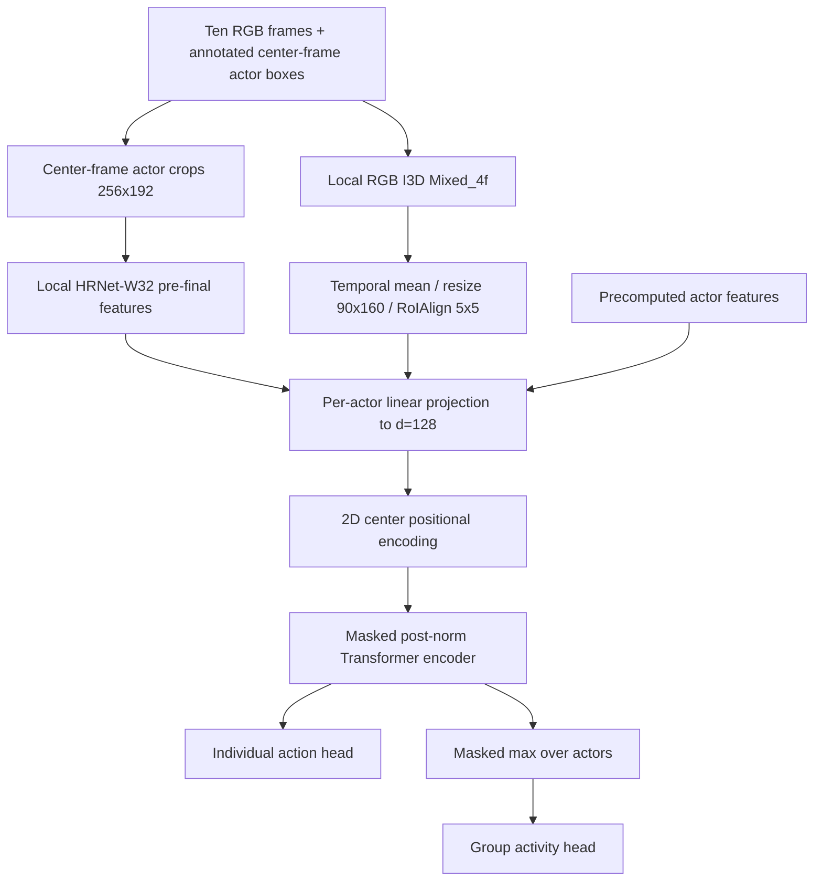
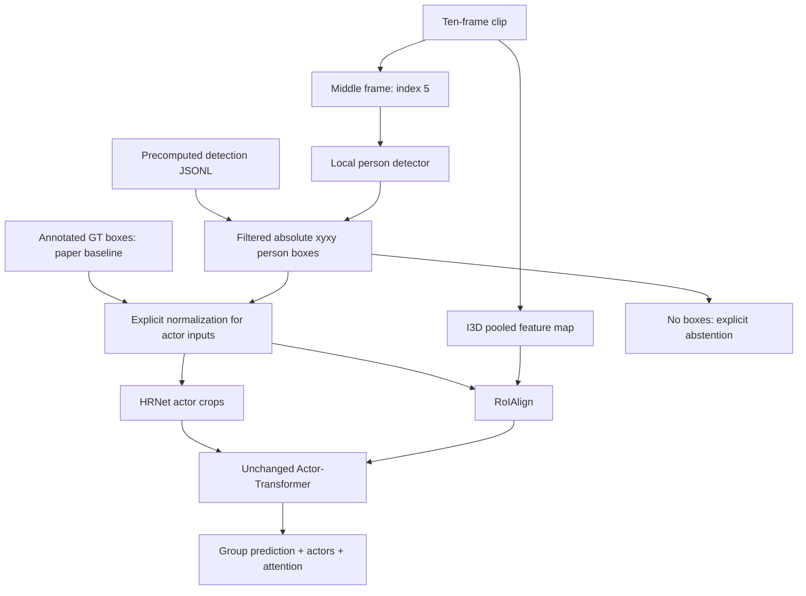

# Surveillance behavior anomaly research

A modular HCI research project for a future classroom/professor demonstration of
violence and suspicious group activity in surveillance video. **Milestone 1 implements
Sultani-style binary anomaly localization. Milestone 2A adds an independent
Actor-Transformer baseline for Collective Activity with annotated actor boxes.**
**Milestone 2B adds automatic person detection and GT-versus-detected box
robustness evaluation. Milestone 2C adds real-data validation, frozen experiment
receipts, validation-only tuning, seed aggregation and error analysis.** The models are not connected yet. Neither model currently
classifies fighting, assault, or robbery. Surveillance behavior adaptation and
the Gradio demo come later.

"Goons" is informal project framing. The system detects **observable behavior**;
it does not infer that a person intrinsically "is a goon," assign character labels,
or infer criminal intent.

## Papers and current status

- Sultani, Chen, and Shah (CVPR 2018), [Real-world Anomaly Detection in Surveillance Videos](https://openaccess.thecvf.com/content_cvpr_2018/html/Sultani_Real-World_Anomaly_Detection_CVPR_2018_paper.html).
  Implemented: C3D feature bags, scoring network, MIL objective, training,
  evaluation, temporal inference, and timelines. [Author implementation](https://github.com/WaqasSultani/AnomalyDetectionCVPR2018)
  supplies the reference network details and coefficients.
- Gavrilyuk, Sanford, Javan, and Snoek (CVPR 2020),
  [Actor-Transformers for Group Activity Recognition](https://arxiv.org/html/2003.12737).
  Implemented: actor representations, positional encoding, masked attention,
  individual/group heads, fusion, training, evaluation, and inference. Local
  HRNet/I3D feature exports or precomputed actor features are required for real use.

**The three-seed real Collective pose/GT-box baseline is measured:** group
accuracy **67.44% +/- 0.58 percentage points** (macro F1 **0.6458 +/- 0.0110**),
actor accuracy **58.72% +/- 1.21 points** (macro F1 **0.5643 +/- 0.0114**).
These are means and sample standard deviations across seeds 0/1/2 on the same
775 held-out scenes / 3,420 actors. This uses **our frozen protocol**, not an
exact paper reproduction. **The real RGB/GT-box seed-0 baseline is also measured:**
group accuracy **77.55%** (macro F1 **0.7947**), actor accuracy **78.22%**
(macro F1 **0.7923**) on that same held-out population. See the
[RGB execution evidence and pose comparison](docs/collective-rgb-execution.md).
**The predefined pose-weighted late-fusion GT-box seed-0 experiment is measured:**
group accuracy **71.48%** (macro F1 **0.6919**), actor accuracy **62.11%**
(macro F1 **0.6079**). It improves walking group recall but underperforms RGB
overall. See the [fixed 2:1 fusion evidence and comparison](docs/collective-late-fusion-execution.md).
The real same-checkpoint RGB detected-box result is **74.32% group accuracy**
(macro F1 **0.7383**) and **75.64% actor accuracy** (macro F1 **0.7756**, matched
actors only). See the [detected-box execution and coverage report](docs/collective-rgb-detected-execution.md).
Surveillance anomaly accuracy remains unmeasured. Synthetic
tests establish software behavior, not surveillance detection accuracy.

## First real pose baseline (Milestone 2C-R1)

The [real pose workflow](docs/milestone-2c-real-pose.md) targets Collective Activity
with **GT actor boxes, official COCO HRNet-W32 256x192 weights and pose-only
Actor-Transformer**. A [local exporter](docs/hrnet-export.md) now converts a supplied
official HRNet checkout/checkpoint into the existing frozen pre-head feature archive.
It validates weights, endpoint equality, shapes, determinism, provenance and adapter
acceptance. No dataset, upstream code or model weights are downloaded or vendored.

```powershell
.\.venv\Scripts\python.exe scripts/export_hrnet_features.py --hrnet-repo "D:/path/to/deep-high-resolution-net.pytorch" --checkpoint checkpoints/external/pose_hrnet_w32_256x192.pth --output checkpoints/hrnet_w32_features_fp32_cudnn.pt
```

Follow the linked workflow to configure the archive/hash, validate all 44 sources,
inspect ten training scenes, run a five-step validation-only preflight, extract
all GT pose caches and freeze. Run **seed 0 explicitly first**, inspect its health,
then authorize seeds 1/2 with identical settings after review. Each run selects checkpoints using validation
only and performs its held-out evaluation once. Read saved results for analysis.
Call any measured result **our frozen Collective protocol**, not an exact paper
reproduction. Historical split equivalence remains unverified, and our crop
preprocessing differs from upstream pose preprocessing.

Supplied local official assets now pass export and real feature checks. Full
pose extraction and all three 20,000-iteration runs completed. Checkpoint
selection used validation only, and held-out inference ran once per seed.
Selected iterations are 1,100 / 600 / 3,000 for seeds 0/1/2. Every head predicts
all five test classes, but validation remains below its 70.59% majority baseline,
despite decreasing training loss. The unchanged validation set lacks waiting and
queueing group scenes. See the [three-seed evidence and limitations](docs/milestone-2c-real-pose.md#multi-seed-pose-only-gt-baseline).
The RGB-only and predefined late-fusion seed-0 experiments have completed under
separate frozen receipts. Same-checkpoint RGB detected-box evaluation has also
completed without retraining.

## Real RGB-only GT-box baseline

The [I3D exporter](docs/i3d-export.md) strictly validates a supplied
`piergiaj/pytorch-i3d` source snapshot and **converted DeepMind ImageNet+Kinetics
I3D RGB weights**. These are not official PyTorch weights. The feature contract is
ten RGB frames at 480x720, `Mixed_4f`, temporal mean, resize to 90x160 and 5x5
RoIAlign, producing 20,800 values per annotated actor.

[collective_rgb_gt_v1.yaml](configs/experiments/collective_rgb_gt_v1.yaml) freezes
this experiment separately from pose. All 2,547 scenes / 12,874 actors were cached;
seed 0 trained for 20,000 iterations and validation selected iteration 1,300.
Held-out inference ran once. The [execution report](docs/collective-rgb-execution.md)
records assets, GPU benchmark, inspection, preflight, cache identities, curves,
class metrics and limitations. Group crossing/walking swaps did not improve
overall despite the higher aggregate scores. One RGB seed does not establish
variance or prove that motion alone caused the gain; the backbones and existing
training batch sizes differ.

## Real predefined late-fusion GT-box baseline

[collective_pose_rgb_late_gt_v1.yaml](configs/experiments/collective_pose_rgb_late_gt_v1.yaml)
reuses both immutable feature caches after exact semantic alignment of all
2,547 scenes / 12,874 actors. Independent 128-d pose/RGB Actor-Transformers are
jointly trained with the existing fixed probability rule `(2*pose + rgb)/3`,
not a post-hoc ensemble of the separately trained classifiers. Seed 0 completed
20,000 iterations; validation selected iteration 2,900, then held-out inference
ran once. No model mathematics, split, preprocessing or fusion weights changed.

Walking group recall rose to **74.31%**, and crossing/walking group swaps fell
to **93** (Pose 106 / RGB 108). Queueing/talking group recalls fell to
**72.04% / 95.60%** from RGB's 100% / 100%; overall group/actor metrics were
lower than RGB. The [execution report](docs/collective-late-fusion-execution.md)
records both recall tables, confusion matrices, freeze identities, validation-only
attention and limitations. This negative result applies to the predefined 2:1
configuration, not every possible fusion method. RGB remains the recommended
current GT-box reference; its same-checkpoint detected-box comparison is now
measured below. No additional fusion-seed run has started.

## Real RGB detected-box comparison

The same frozen RGB `best.pt` is evaluated with COCO v1 Faster R-CNN ResNet-50
FPN boxes, without training. Validation-only confidence selection chooses 0.7;
NMS/matching IoU 0.5 and all other geometry/cap rules remain fixed. All 2,547
scenes receive independent detected-box I3D caches with unchanged preprocessing.
The [execution report](docs/collective-rgb-detected-execution.md) records the
official checkpoint, native legacy-key loading correction, receipts and results.

Test group accuracy falls **77.55% -> 74.32%**, macro F1 **0.7947 -> 0.7383**.
Waiting recall falls **65.93% -> 37.78%** while walking rises **60.55% -> 72.94%**;
queueing/talking recalls stay 100%. Test actor coverage is **86.55%**: 2,960 matches,
460 misses and 2,333 unmatched detections; no scene abstains. Detected actor metrics
are conditional on matching. On the same matched subset, GT/detected actor
accuracy is **76.55% / 75.64%**, a **0.91-point** decline. Unmatched detections
may be unannotated people, duplicates or poor localization, not necessarily false
person detections. No detected-box fine-tuning or surveillance adaptation has run.

## Collective benchmark workflow (Milestone 2C)

The [Collective protocol](docs/collective-protocol.md) distinguishes synthetic
software verification from measured real-data research. All settings are resolved
from [collective_protocol.yaml](configs/experiments/collective_protocol.yaml).
Actual dataset images/annotations and compatible local feature/detector checkpoints
are required; none are included or downloaded automatically.



The original 32/12 source assignment is retained; sources 1,2,3 form a training-only
validation holdout. Exact identity with the paper's unpublished split IDs remains
unverified. GT-box results are the annotated-actor baseline; detected-box results
are the deployment-oriented adaptation. Real CCTV will not supply annotated actors.
Test sources never enter detector tuning or checkpoint selection. The current RGB
reference was explicitly user-selected after the measured GT modality comparison.
Comparison reports distinguish all-GT actors, matched-only actor metrics,
coverage and empty-scene abstentions. Pose/GT-box and RGB/GT-box results are
measured above; the same-checkpoint RGB detected-box result is also measured.

```powershell
python scripts/run_collective_experiment.py --stage prepare
python scripts/run_collective_experiment.py --stage inspect --experiment pose_gt --max-scenes 10
python scripts/run_collective_experiment.py --stage preflight --experiment pose_gt --seed 0 --max-scenes 10 --max-iterations 5
python scripts/run_collective_experiment.py --stage extract --experiment pose_gt
python scripts/run_collective_experiment.py --stage run --experiment pose_gt --seed 0 --dry-run --max-scenes 10 --max-iterations 5
python scripts/run_collective_experiment.py --stage freeze --experiment pose_gt
python scripts/run_collective_experiment.py --stage run --experiment pose_gt
```

First configure local export paths in the YAML. See the protocol document for RGB,
fusion, detector tuning, comparison, aggregation and error-analysis commands.
Each run stores resolved settings, environment metadata, checkpoint hashes,
TensorBoard/history logs, metrics, predictions and error records under ignored
`runs/collective/<experiment>/seed_<seed>/`. Preflight validates dataset structure
and bounds extraction/training to training/validation scenes. Dry runs use
`preflight/`, evaluate validation only, and are marked non-benchmark.
Freeze receipts reject changed settings, source bytes or stale feature caches.

`python scripts/smoke_collective_experiment.py --output outputs/collective-smoke-new`
verifies the orchestration without real data or weights. Use a new output directory.
The [Milestone 2C verification record](docs/milestone-2c-verification.md) records
what was actually tested and the remaining external dependencies.



## Installation

Python **3.11+**. Run from the repository root. CPU is supported; install a
compatible CUDA PyTorch build separately if required. Installation downloads Python
dependencies, never datasets or pretrained weights. Actor feature extraction uses
torchvision RoIAlign; install matching torch/torchvision builds for your device.

```powershell
python -m venv .venv
.venv\Scripts\Activate.ps1
python -m pip install -e ".[dev]"
```

Alternatively, with uv:

```powershell
uv --cache-dir .uv-cache venv .venv --python python
uv --no-cache pip install --python .venv/Scripts/python.exe -e ".[dev]"
```

Without activation, use `.venv/Scripts/python.exe` instead of `python`. For
deterministic CUDA GEMM set `$env:CUBLAS_WORKSPACE_CONFIG = ":4096:8"` before
starting Python. Reproducibility assumes a fixed software and device environment.

## Datasets and manifests

Install [DCSASS](https://www.kaggle.com/datasets/mateohervas/dcsass-dataset) and
UCF-Crime locally following [data/README.md](data/README.md), including its label,
source-map, split-list, and temporal-annotation formats. **DCSASS derives from
UCF-Crime material; these are not independent cross-dataset evidence.** Use common
original source IDs and source-aware splits. Official UCF held-out sources must also
be held out from DCSASS training when using the official UCF test set.

```powershell
python scripts/prepare_dcsass.py --root data/raw/dcsass --labels data/raw/dcsass/labels.csv --output data/manifests/dcsass.jsonl --seed 7
python scripts/prepare_ucf_crime.py --root data/raw/ucf_crime --output data/manifests/ucf_crime.jsonl --train-list data/splits/ucf_train.txt --test-list data/splits/ucf_test.txt --annotations data/splits/ucf_temporal.txt
```

Omit official list/annotation flags if unavailable to create a seeded **research
split**, not an official benchmark split. Unknown original identities require a
`--source-map`. Inspect printed split/class counts before training: group splitting
is not stratified and tiny splits may lack a class. DCSASS requires actual clip
labels in a normalized CSV; folder names are not sufficient for binary labels.

## C3D features

Precomputed bags are finite `[32,4096]` `.npy` arrays or tensor `.pt`/`.pth` files;
author-style whitespace `.txt` bags are supported. Bags must already be temporal
means and L2-normalized. Add `feature_path` to manifest records. Paths resolve
relative to the manifest directory. Training does not silently alter imported bags.

For raw video supply compatible **local pretrained C3D FC6 weights**. The adapter
strictly checks parameter keys/shapes, with no random-weight extraction fallback
or torchvision substitution. The CLI requires checkpoint-specific means/order:

```powershell
python scripts/extract_c3d.py --manifest data/manifests/ucf_crime.jsonl --output-manifest data/manifests/ucf_features.jsonl --feature-dir data/features/c3d --c3d-checkpoint checkpoints/c3d_fc6.pt --mean 0 0 0 --channel-order bgr --device auto
```

**Zero means here illustrate syntax; they are not verified pretrained settings.**
Replace mean/order with your checkpoint's preprocessing. Spatial mean volumes,
alternative crops, or scaling require adapting and validating `video/transforms.py`.
Extraction uses nonoverlapping 16-frame clips at native FPS, final-frame padding,
post-ReLU FC6, segment averaging, and L2 normalization.

For N >= 32 units, boundaries `floor(i*N/32)` cover every unit once. For N < 32,
32 disjoint nonempty partitions are impossible: the documented policy repeats
`floor(i*N/32)` units in order. Empty inputs fail.

## Training

```powershell
python scripts/train_sultani.py --config configs/sultani_mil.yaml --manifest data/manifests/ucf_features.jsonl --output runs/sultani
tensorboard --logdir runs/sultani/tensorboard
# For an interrupted run, resume below. After a completed run, first increase
# training.epochs in configs/sultani_mil.yaml (for example, 20 to 30).
python scripts/train_sultani.py --config configs/sultani_mil.yaml --manifest data/manifests/ucf_features.jsonl --output runs/sultani --resume runs/sultani/last.pt
```

Network: `4096 -> 512 (ReLU) -> 32 (linear) -> 1 (sigmoid)`, dropout 0.6 after
both hidden layers and Xavier normal initialization, matching the released author
network. Shapes: `[B,S,D] -> [B,S]`; dimensions/dropout are configurable.
`batch_size: 30` means 30 abnormal/normal **pairs**, or 60 videos. Each epoch visits
the larger class and cycles through the independently shuffled smaller class.

```text
ranking    = mean_b relu(margin - max_s a[b,s] + max_s n[b,s])
sparsity   = mean_b sum_s a[b,s]
smoothness = mean_b sum_s (a[b,s+1] - a[b,s])^2
MIL total  = ranking + lambda_sparse*sparsity + lambda_smooth*smoothness
train loss = MIL total + weight_l2 * sum(weight parameters squared)
```

The loss API exposes unweighted components and weighted total. `8e-5` sparsity and
smoothness coefficients and `0.001` squared-weight penalty follow released author
code. Our reductions average over pairs/bags; its released implementation compares
all normal/abnormal pairs and scales regularization differently. This is a readable
paper-style baseline, not an exact Keras/Theano training port.

Adagrad LR **0.001** follows the requested default (released author script: 0.01).
Our **20 epochs**, pair sampling, and validation selection are implementation
defaults, not claimed paper settings. Adagrad, Adam, and SGD are configurable.
`last.pt` saves model, optimizer, config, epoch, best value, and selection metric.
`best.pt` selects validation **bag ROC-AUC** when both classes exist; otherwise
minimum training loss, with a warning. Test data never selects checkpoints.
Resume in the same run directory. Settings must match except the total epoch target,
which can increase. Per-epoch seeds support deterministic resumption.
Use the same manifest/features when resuming; checkpoints do not fingerprint the data.

## Evaluation

```powershell
python scripts/evaluate_sultani.py --checkpoint runs/sultani/best.pt --manifest data/manifests/ucf_features.jsonl --mode bag --output outputs/bag_metrics.json
python scripts/evaluate_sultani.py --checkpoint runs/sultani/best.pt --manifest data/manifests/ucf_features.jsonl --mode frame --projection repeat --output outputs/frame_metrics.json
```

JSON includes ROC points/AUC, precision, recall, F1, false-positive rate, and
`[[TN,FP],[FN,TP]]` confusion matrix. Single-class ROC-AUC is undefined (`null`).
The default threshold is 0.5; tune thresholds on validation data.
Bag mode uses maximum segment score and weak video labels. This reduced evaluation
**is not UCF frame-level ROC-AUC**. Frame mode requires temporal ground truth for
abnormal videos; it refuses missing annotations. Normal labels imply normal frames.
Projection uses uniform floor partitions or segment/frame-center interpolation.
Uniform duration alignment approximates unequal clip partitions and final padding; validate
exact feature/frame alignment before claiming benchmark reproduction.

## Inference and visualization

```powershell
python scripts/infer_video.py --checkpoint runs/sultani/best.pt --features data/features/c3d/ucf_crime/Fighting/Fighting001_x264.npy --duration-sec 120 --output outputs/anomaly.json
python scripts/infer_video.py --checkpoint runs/sultani/best.pt --video data/raw/ucf_crime/Fighting/Fighting001_x264.mp4 --c3d-checkpoint checkpoints/c3d_fc6.pt --mean 0 0 0 --channel-order bgr --threshold 0.5
```

Replace raw-video mean/order as described above. Missing C3D weights produce useful
errors. Feature inference only needs the trained scorer. Result: maximum overall
score, 32 scores, segment start/end seconds, merged suspicious intervals, and
metadata. Scores are not calibrated probabilities. The timeline defaults to
`outputs/anomaly_timeline.png`; `configs/demo.yaml` supplies the default threshold.

```python
from pathlib import Path
from surveillance.inference.anomaly_pipeline import AnomalyPipeline
from surveillance.training.sultani_trainer import load_checkpoint

model, saved = load_checkpoint(Path("runs/sultani/best.pt"))
pipeline = AnomalyPipeline(model, num_segments=saved["config"]["num_segments"])
# features: precomputed [32,4096] NumPy array or torch tensor
result = pipeline.predict_features(features, duration_sec=120, threshold=0.5)
```

## Testing and structure

Tests generate synthetic features, tiny videos, and explicitly synthetic local
backbone exports. C3D shape tests use meta tensors; no dataset or pretrained
checkpoint download is required. Python 3.13.5 with CPU PyTorch/torchvision has
been exercised. TorchScript emits deprecation warnings in modern PyTorch; the
local archive contract and its limitations are documented below.

```powershell
python -m pytest -q --basetemp .pytest_cache/local-temp
ruff check .
ruff format --check .
```

```text
configs/                   Experiment and inference YAML
data/                      README, manifests/, splits/
src/surveillance/
  config.py, actor_config.py YAML loading and experiment validation
  datasets/                JSONL, source splits, DCSASS/UCF/Collective, actor batches
  video/                   Decode, segmentation, C3D transforms
  features/                C3D FC6, local HRNet/I3D adapters, box geometry/RoIAlign
  models/sultani/           Scorer and MIL objective
  models/actor_transformer/ Position, encoder, heads, fusion, joint loss
  training/                MIL/actor trainers, seeds, checkpoints, TensorBoard
  evaluation/              Binary/frame and group/actor metrics
  inference/               AnomalyPipeline and GroupActivityPipeline
  visualization/           File-based timeline and actor attention
scripts/                   Preparation, joint split, extraction, train/eval/infer
tests/                     Numerical, leakage, video and pipeline coverage
docs/                      Implementation record
```

## Limitations and future work

External data and compatible pretrained C3D weights remain required for real
experiments. Record their licenses and preprocessing/source provenance. Container
frame metadata can be approximate; frame evaluation assumes constant FPS. The
decoder does not resample FPS. Source splitting cannot detect wrong source IDs.
The binary scorer can mistake unusual benign behavior for anomalies. No operational
accuracy or benchmark result is established.

Next, establish real Collective performance with annotated boxes and compare
detected boxes against that reference using the Milestone 2B evaluation tools.
Measure missed actors and annotation coverage before adding appropriately annotated
surveillance behavior data.
Connect Sultani windows only after these independent components are validated.
Labels such as fighting/aggressive interaction require actual annotations; anomaly
scores cannot supply these classes. Tracking and a Gradio demonstration are later
work. Ground-truth actor boxes will not be available in real CCTV deployment.

## Milestone 2A: independent Actor-Transformer



Each branch projects actor features to 128 dimensions, adds sinusoidal center
coordinates (x in the first half, y in the second), and runs one encoder layer
with one head, a 256-wide ReLU feed-forward block, and dropout 0.1. A linear
individual-action head and a linear group head after masked max pooling classify
crossing, waiting, queueing, walking, and talking. The group target is the majority
actor action. The models remain vocabulary-agnostic for later Volleyball support.

| Tensor | Shape and meaning |
|---|---|
| `pose_features` / `rgb_features` | `[B,N,Dp]` / `[B,N,Dr]`; defaults 98,304 / 20,800 |
| `actor_boxes` | `[B,N,4]`, normalized xyxy edge coordinates |
| `actor_valid_mask` | `[B,N]`, True for real actors |
| `actor_logits` / `group_logits` | `[B,N,C_actor]` / `[B,C_group]` |
| optional attention | Per branch `[B,layers,heads,N,N]` |

Batches pad to their largest actor count. Invalid keys are excluded from attention;
padded queries/outputs are zeroed. Max pooling uses negative infinity for padding,
and actor loss/metrics select only valid actors. Padded NaNs cannot contaminate
valid outputs. Empty scenes are rejected; single-actor scenes are supported.

Modes are `pose_only`, `rgb_only`, `pose_rgb_early_fusion` (concatenate projected
features and project to d), and `pose_rgb_late_fusion` (independent branches,
probability mixture `(2*pose + rgb)/3` by default). Late fusion returns stable
log-probabilities as logits, so cross-entropy and inference softmax are consistent.
Its pose weight is configurable. Joint loss exposes `total`, `group`, and `actor`:

```text
group = mean cross_entropy(group_logits, group_labels)
actor = mean cross_entropy(actor_logits[valid], actor_labels[valid])
total = group_weight * group + actor_weight * actor
```

Both weights default to one. Loss averages actors across the batch, not per scene.

### Collective setup and precomputed workflow

Acquire the dataset yourself and follow [data/README.md](data/README.md#collective-activity-milestone-2a)
and the [verified annotation/split specification](docs/collective-format.md).
Preparation consumes the actual `seqNN/annotations.txt` and `frameNNNN.jpg` layout.
The default is a documented 32/12 split; the optional development validation list
below removes three sources from the training pool without touching test data.

```powershell
python scripts/prepare_collective.py --root data/raw/collective --output data/manifests/collective.jsonl --val-sequences 1 2 3
python scripts/extract_pose_features.py --manifest data/manifests/collective.jsonl --output-manifest data/manifests/collective_pose.jsonl --feature-dir data/features/collective --checkpoint checkpoints/hrnet_w32_features.pt --device auto
python scripts/train_actor_transformer.py --config configs/actor_transformer_pose_only.yaml --manifest data/manifests/collective_pose.jsonl --output runs/actor_pose
python scripts/evaluate_actor_transformer.py --checkpoint runs/actor_pose/best.pt --manifest data/manifests/collective_pose.jsonl --split test --output outputs/actor_pose_metrics.json
python scripts/infer_group_activity.py --checkpoint runs/actor_pose/best.pt --manifest data/manifests/collective_pose.jsonl --split test --attention --output outputs/actor_pose_predictions.json
tensorboard --logdir runs/actor_pose/tensorboard
```

For RGB, extract I3D features and use the RGB config:

```powershell
python scripts/extract_i3d_features.py --manifest data/manifests/collective_pose.jsonl --output-manifest data/manifests/collective_both.jsonl --feature-dir data/features/collective --checkpoint checkpoints/i3d_mixed4f.pt --device auto
python scripts/train_actor_transformer.py --config configs/actor_transformer.yaml --manifest data/manifests/collective_both.jsonl --output runs/actor_rgb
```

The second extraction preserves pose references, actor order, and splits. For
late fusion copy a config, set `model.mode: pose_rgb_late_fusion`, and train using
`collective_both.jsonl`. Imported arrays must be finite float `.npy` files `[N,D]`
matching manifest actor order and configured dimensions. Set `pose_feature_path`
and/or `rgb_feature_path` relative to the JSONL file (absolute paths also work).
Feature-only training does not read images. Extraction writes provenance sidecars
with checkpoint SHA256, preprocessing, boxes, and feature shape.

### Local HRNet and I3D checkpoints

The adapters require **vetted feature-only TorchScript exports**, not arbitrary
classifier state dictionaries. See [the full export contract](docs/actor-backbones.md)
for embedded JSON metadata, exact endpoints, export commands, preprocessing, and
references to the original backbones. HRNet-W32 must emit pre-final-layer
`[actors,32,64,48]` features; I3D must emit `[B,832,t,h,w]` at `Mixed_4f`.
This repository implements the adapters, crop/pooling/RoI operations and validation,
with [HRNet](docs/hrnet-export.md) and [I3D](docs/i3d-export.md) export boundaries
validated against supplied local assets. Upstream code and weights are not shipped.
Missing or incompatible local exports fail clearly. No weights are downloaded.

Raw training uses the same trainer: copy a config, set `data.input_mode: raw`,
and set the enabled `backbones.pose.checkpoint` / `backbones.rgb.checkpoint` paths.
Paths in YAML resolve relative to that YAML file. Set `frozen: false` to fine-tune
an export that preserves parameters and train/eval behavior; the default freezes
it. Use `collective.jsonl` as the manifest. Input frames are `[B,10,3,H,W]` RGB in
[0,1]; export-specific normalization is applied by the adapter. The raw checkpoint
stores trained backbone parameters and declared metadata, but loading still needs
the original compatible local architecture export.

### Training, evaluation, and inference details

Adam defaults to LR 1e-4, betas 0.9/0.999, with 0.1 drops after 5,000 and 10,000
optimizer steps and a 20,000-step horizon. Configurable AdamW/SGD are also available.
TensorBoard records losses, LR and validation group accuracy. `last.pt` stores
iteration, optimizer/scheduler, config, model/backbones and manifest fingerprint;
`best.pt` uses validation group accuracy. Without validation, an explicit warning
announces selection by negative training loss; test data never selects checkpoints.

```powershell
python scripts/train_actor_transformer.py --config configs/actor_transformer_pose_only.yaml --manifest data/manifests/collective_pose.jsonl --output runs/actor_pose --resume runs/actor_pose/last.pt
```

Resume in the same run directory; only `training.max_iterations` may be increased.
Per-iteration seeds make interrupted/resumed training repeatable in the same
software/device environment. The fingerprint checks manifest bytes, **not image
or feature file contents**; preserve those files and extraction provenance when
resuming. Changed declared raw-backbone preprocessing/provenance is rejected.

Evaluation reports group accuracy, per-class accuracy/support, macro F1, and a
confusion matrix (rows true, columns predicted), plus individual accuracy/macro F1.
Macro F1 includes all configured classes; absent-class accuracy is null. Predictions
include group/actor probabilities, class names, boxes, metadata, and optional
unpadded per-branch attention. Probabilities are not calibrated confidence estimates.

```python
from pathlib import Path
import numpy as np
from surveillance.training.actor_transformer_trainer import load_checkpoint
from surveillance.inference.group_activity_pipeline import GroupActivityPipeline
from surveillance.visualization.actor_attention import save_actor_attention

system, saved = load_checkpoint(Path("runs/actor_pose/best.pt"), device="cpu")
pipeline = GroupActivityPipeline(system)
# batch: pose_features [B,N,D], actor_boxes [B,N,4], actor_valid_mask [B,N].
# Labels are optional for predict_batch; collate_actors can build labeled batches.
scenes = pipeline.predict_batch(batch, return_attention=True)
matrix = np.asarray(scenes[0]["attention"]["pose"]).mean(axis=(0, 1))
save_actor_attention(matrix, Path("outputs/actor_attention.png"))
```

Attention describes model interactions; it is not evidence of causality or intent.

### Fidelity and implementation choices

Paper-aligned architecture/settings: ten frames at offsets -5..4; HRNet-W32 pose
crop 256x192; RGB I3D Mixed_4f, temporal mean and 5x5 RoIs; d=128; one post-norm
encoder layer/head; FF=256; dropout 0.1; 2D sinusoidal position; actor/group heads;
max pooling; equal loss weights; Adam iteration schedule; pose-weighted late fusion.

The following are explicit implementation choices, so this is **not an exact
paper reproduction**; measured pose/GT-box results use our declared protocol:

- Center-frame pose for both training and testing, rather than random training
  frames; no tracking/interpolation of center annotations.
- Normalized box centers mapped to a configurable 480x720 positional reference
  grid; direct stretched actor crops, no unverified augmentation recipe.
- RoIAlign `aligned=True`, sampling ratio 2; bilinear resize with
  `align_corners=False`; a versioned local TorchScript export boundary.
- Frozen/precomputed backbones by default, early concatenation/projection, and
  joint training of late-fusion branches using cross-entropy on the mixture.
- Adam epsilon 1e-8, gradient clipping 1.0, deterministic scene sampling,
  optional source validation holdout, tie-breaking by lowest class ID.
- The 32/12 source IDs are verified from a related method's released loader;
  the Actor-Transformers paper does not enumerate its exact sequence IDs.

Modern `MultiheadAttention` is used with explicit `key_padding_mask=~valid`,
post-norm residual blocks, and `average_attn_weights=False`. This avoids opaque
padding semantics and exposes per-head attention. Synthetic tests verify masking,
coordinates, gradients, frozen/unfrozen extraction and deterministic resume.
Official HRNet export, converted I3D export and real pose/RGB/predefined-fusion
GT-box accuracy are now verified under our frozen protocols. The RGB detected-box
comparison is also measured with the same checkpoint and separate frozen settings.

Run the offline workflow (creates its own tiny features, then trains, saves,
reloads, evaluates and infers on scenes with different actor counts):

```powershell
python scripts/smoke_actor_transformer.py --output outputs/actor_smoke --mode pose_rgb_late_fusion --iterations 3
python -m pytest -q --basetemp .pytest_cache/local-temp
ruff check .
ruff format --check .
git diff --check
```

## Milestone 2B: automatic actors and box robustness

Annotated actor boxes are the paper baseline; a CCTV deployment must find people
itself. The detector is replaceable infrastructure, not a contribution of either
research paper. The **same Actor-Transformer checkpoint and unchanged model math**
can now use GT actors, cached detections, or local detector inference.



The default backend is local TorchVision COCO Faster R-CNN ResNet-50 FPN v1.
Both model and backbone pretrained flags are disabled during construction; a
compatible local state dictionary is loaded strictly. No weights are downloaded.
Set `detector.checkpoint` in `configs/person_detector.yaml` (relative to the YAML
directory). Missing weights fail clearly. Random weights are available only through
an explicit structural-test API and are not meaningful detections.

```powershell
python scripts/detect_people.py --manifest data/manifests/collective.jsonl --config configs/person_detector.yaml --output data/manifests/collective_detections.jsonl
python scripts/evaluate_detector.py --manifest data/manifests/collective.jsonl --detections data/manifests/collective_detections.jsonl --split test --output outputs/detector_metrics.json
python scripts/match_actor_boxes.py --manifest data/manifests/collective.jsonl --detections data/manifests/collective_detections.jsonl --split test --output outputs/actor_matches.json
```

Detection JSONL contains native image dimensions, source/reference identities,
absolute pixel boxes, confidence, person class IDs, filtering counts and model
provenance. Empty detection lists are valid records. Precomputed artifacts let
evaluation/extraction run repeatedly without detector inference. See the exact
[data format](data/README.md#person-detections-and-feature-caches-milestone-2b).

The existing extraction CLIs share their GT and detected-box paths:

```powershell
python scripts/extract_pose_features.py --manifest data/manifests/collective.jsonl --box-source detections --detections data/manifests/collective_detections.jsonl --output-manifest data/manifests/collective_detected_pose.jsonl --feature-dir data/features/collective --checkpoint checkpoints/hrnet_w32_features.pt
python scripts/extract_i3d_features.py --manifest data/manifests/collective.jsonl --box-source detections --detections data/manifests/collective_detected_pose.jsonl --output-manifest data/manifests/collective_detected_both.jsonl --feature-dir data/features/collective --checkpoint checkpoints/i3d_mixed4f.pt
```

GT features and detected features are separate: even a matched detection gets
features from **its own crop**, never copied from the GT actor. Feature manifests
preserve ordered detections and content hashes. The original GT manifest/labels
remain the annotation authority. A missing detection record is an error; an empty
record is a measured detection failure and is retained.

For a pose checkpoint, use its original GT pose-feature manifest and the detected
pose-feature artifact. RGB/fusion comparisons analogously require both matching
feature sets. Raw-mode checkpoints can extract both box conditions directly using
their original local backbone exports.

```powershell
python scripts/compare_actor_boxes.py --checkpoint runs/actor_pose/best.pt --manifest data/manifests/collective_pose.jsonl --detections data/manifests/collective_detected_pose.jsonl --split test --config configs/person_detector.yaml --output outputs/box_robustness.json
python scripts/infer_group_activity.py --checkpoint runs/actor_pose/best.pt --manifest data/manifests/collective.jsonl --box-source detections --detections data/manifests/collective_detected_pose.jsonl --split test --attention --output outputs/detected_activity.json
```

Matching maximizes the number of pairs meeting the inclusive IoU threshold, then
their total IoU. Only matched detections inherit actor labels; extras still enter
group attention/pooling but are excluded from actor accuracy/F1. Report precision,
recall, localization F1, mean matched IoU, missed actors, extra detections, and mean
actor count alongside downstream classification. "Extra" means unmatched to the
annotated actor subset, not proof that a detection is not a real person.

The comparison JSON distinguishes the paper GT condition from the detected-box
adaptation. It reports group accuracy on supported scenes and on **all scenes with
abstentions counted as incorrect**, plus matched-only actor metrics and coverage.
Paired classification deltas use identical scene/actor subsets. Undefined metrics
are null. No failed scenes disappear from the denominator silently.

```powershell
python scripts/smoke_detection.py --output outputs/detection_smoke
python -m pytest -q --basetemp .pytest_cache/local-temp
ruff check .
ruff format --check .
git diff --check
```

The smoke creates synthetic RGB images, fixture detections and simple crop-mean
features, trains a tiny scorer, and exercises live detection, cached comparison,
misses/extras, and empty-scene abstention. These fixtures are not HRNet/I3D or
detector benchmark results. Real RGB detected-box accuracy is documented above. No tracking,
surveillance adaptation, Sultani cascade, or UI is added in this milestone.
See [person-detection.md](docs/person-detection.md) for policies, APIs, local
checkpoint compatibility, cache provenance, and limitations.

The subsequent [matched-only actor-set diagnostic](docs/collective-detected-actor-ablation.md)
uses GT matching to remove unmatched detections while retaining their detected
geometry/features and the same RGB checkpoint. This oracle-assisted setting is
not deployable: group accuracy falls from 74.32% to 72.65%, while macro F1 rises
from 0.7383 to 0.7536. Waiting improves but walking degrades. It recovers 42 of
the original 73 GT-correct/detected-wrong scenes, yet introduces other errors;
the result does not support blanket actor removal. No fine-tuning or threshold
retuning was performed.
